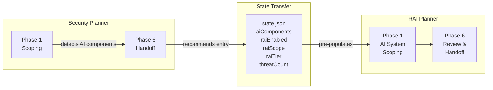
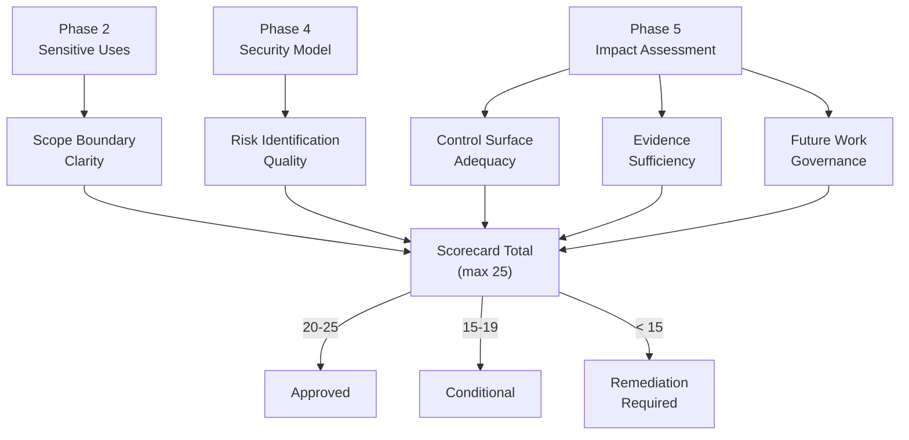

## Security Planner to RAI Planner Pipeline

The Security Planner and RAI Planner form a connected assessment pipeline. When the Security Planner detects AI or ML components during Phase 1, it captures component details and enables RAI dispatch. At Phase 6, the Security Planner recommends starting the RAI Planner in `from-security-plan` mode.

<!-- cspell:ignore nrai -->

### What the RAI Planner Receives

When entering via `from-security-plan` mode, the RAI Planner reads the security plan's `state.json` and inherits:

| Data                    | Source field         | How it is used                                     |
|-------------------------|----------------------|----------------------------------------------------|
| AI component inventory  | `aiComponents` array | Pre-populates Phase 1 AI element catalog           |
| RAI assessment scope    | `raiScope`           | Sets initial assessment boundaries                 |
| RAI depth tier          | `raiTier`            | Determines assessment depth (`standard` or `deep`) |
| Threat count            | threat catalog size  | Starting sequence for `RAI-T-{CATEGORY}-{NNN}` IDs |
| Security plan reference | state.json path      | Stored in `securityPlanRef` for cross-referencing  |

> [!NOTE]
> The RAI Planner reads security plan artifacts as read-only. It never modifies files under `.copilot-tracking/security-plans/`.

## Scorecard Generation

Phase 6 produces a scorecard that quantifies assessment quality across five dimensions. Each dimension receives a score from 1 to 5, producing a maximum total of 25.

### Outcome Definitions

| Outcome              | Score range | Meaning                                                          |
|----------------------|-------------|------------------------------------------------------------------|
| Approved             | 20-25       | Assessment is comprehensive; proceed with identified mitigations |
| Conditional          | 15-19       | Gaps exist; proceed with conditions and a remediation timeline   |
| Remediation Required | Below 15    | Significant gaps; address findings before proceeding             |

## Backlog Generation

Gaps identified during Phases 2 through 5 are converted to work items using the same dual-platform format as the Security Planner.

### Dual-Platform Support

| Platform | ID format        | Formatting                     | Target system           |
|----------|------------------|--------------------------------|-------------------------|
| ADO      | `WI-RAI-{NNN}`   | HTML `
` wrapper           | Azure DevOps work items |
| GitHub   | `{{RAI-TEMP-N}}` | Markdown with YAML frontmatter | GitHub issues           |

### Autonomy Tiers

Each generated work item receives an autonomy tier based on the severity and complexity of the finding.

| Tier    | Human involvement                                    | When assigned                                                                           |
|---------|------------------------------------------------------|-----------------------------------------------------------------------------------------|
| Full    | Agent creates and submits without confirmation       | Low-severity findings with clear remediation                                            |
| Partial | Agent creates items; user confirms before submission | Default tier for most findings                                                          |
| Manual  | Agent recommends; user creates items                 | High-severity findings, restricted use escalations, or cross-team coordination required |

### Content Sanitization

All generated backlog content is sanitized before handoff:

* No secrets, credentials, or API keys
* No internal URLs or infrastructure details
* No PII or personally identifiable information
* No proprietary model weights or training data references

## Pipeline Artifacts

| Artifact                    | Path                                                                | Generated during |
|-----------------------------|---------------------------------------------------------------------|------------------|
| System definition pack      | `.copilot-tracking/rai-plans/{slug}/system-definition-pack.md`      | Phase 1          |
| Stakeholder impact map      | `.copilot-tracking/rai-plans/{slug}/stakeholder-impact-map.md`      | Phase 1          |
| Sensitive uses screening    | `.copilot-tracking/rai-plans/{slug}/sensitive-uses-screening.md`    | Phase 2          |
| Use-misuse inventory        | `.copilot-tracking/rai-plans/{slug}/use-misuse-inventory.md`        | Phase 2          |
| RAI standards mapping       | `.copilot-tracking/rai-plans/{slug}/rai-standards-mapping.md`       | Phase 3          |
| RAI security model addendum | `.copilot-tracking/rai-plans/{slug}/rai-security-model-addendum.md` | Phase 4          |
| Control surface catalog     | `.copilot-tracking/rai-plans/{slug}/control-surface-catalog.md`     | Phase 5          |
| Evidence register           | `.copilot-tracking/rai-plans/{slug}/evidence-register.md`           | Phase 5          |
| RAI tradeoffs               | `.copilot-tracking/rai-plans/{slug}/rai-tradeoffs.md`               | Phase 5          |
| RAI scorecard               | `.copilot-tracking/rai-plans/{slug}/rai-scorecard.md`               | Phase 6          |

End-to-end assessment flow

1. Security Planner completes Phase 6 with `raiEnabled: true` and AI component data in state
2. User starts RAI Planner with `from-security-plan` prompt, providing the security plan project slug
3. RAI Planner reads security plan state and pre-populates Phase 1 with AI components and threat count
4. Phases 1-5 proceed with focused assessment of AI-specific risks, building on the security plan's foundation
5. Phase 6 produces the RAI scorecard with scored dimensions and outcome determination
6. Backlog items are generated for identified gaps using the user's preferred platform format
7. Assessment artifacts persist under `.copilot-tracking/rai-plans/{project-slug}/` for future reference and updates

<!-- markdownlint-disable MD036 -->
*🤖 Crafted with precision by ✨Copilot following brilliant human instruction,
then carefully refined by our team of discerning human reviewers.*
<!-- markdownlint-enable MD036 -->
