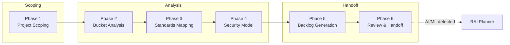

The Security Planner agent walks your team through a structured six-phase security analysis. It starts with project scoping, classifies components into operational buckets, maps relevant standards, performs STRIDE-based threat modeling, generates prioritized backlog items, and hands off to the RAI Planner when AI/ML components are detected.

> The goal is not to replace security expertise. It is to make sure the right questions get asked, the right standards get referenced, and the resulting work items land in your backlog with enough context to act on.

## Why Use Security Planning?

| Benefit                             | Description                                                                                                                   |
|-------------------------------------|-------------------------------------------------------------------------------------------------------------------------------|
| 🛡️ Consistent coverage             | Every project gets the same structured analysis across seven operational buckets, so nothing falls through the cracks         |
| 🔍 Standards-backed threat modeling | Threats are mapped to OWASP Top 10, NIST 800-53, and CIS Benchmarks rather than ad-hoc checklists                             |
| ⚡ Actionable output                 | The final phase produces backlog items with acceptance criteria, autonomy tiers, and direct links to the threats they address |

> [!TIP]
> New to the agent? Read [Why Security Planning?](why-security-planning) for the reasoning behind each phase.

## The Security Planning Flow

## The Six Phases

### Phase 1: Project Scoping

Captures the project's purpose, technology stack, deployment model, data classification, and compliance requirements. When AI/ML components are detected, the agent flags them and sets the scope for a downstream RAI assessment.

### Phase 2: Bucket Analysis

Classifies the application into seven operational buckets: infrastructure, DevOps/platform-ops, build, messaging, data, web/UI/reporting, and identity/auth. A cross-cutting "GS" overlay captures concerns that span multiple buckets.

### Phase 3: Standards Mapping

Maps each operational bucket to the relevant controls from OWASP Top 10, NIST 800-53, and CIS Benchmarks. The agent dispatches a Researcher Subagent for WAF and CAF runtime lookups when cloud-hosted components are in scope.

### Phase 4: Security Model Analysis

Performs STRIDE-based threat modeling per bucket, generating threats in `T-{BUCKET}-{NNN}` format. Each threat receives a likelihood-impact severity rating, and data flow diagrams connect threats to the components they affect.

### Phase 5: Backlog Generation

Produces work items for Azure DevOps (`WI-SEC-{NNN}`) or GitHub Issues (`{{SEC-TEMP-N}}`), each linked to the threats and standards that motivated it. Items are assigned one of three autonomy tiers that control how much human review is required.

### Phase 6: Review and Handoff

Summarizes the full analysis, validates completeness across all buckets, and presents the final deliverables. When Phase 1 detected AI/ML components, this phase dispatches the RAI Planner with a pre-seeded security context.

## Autonomy Levels

Work items generated in Phase 5 are assigned an autonomy tier that controls how much human oversight each item receives.

| Tier    | Description                     | When used                                         |
|---------|---------------------------------|---------------------------------------------------|
| Full    | Agent executes without approval | Low-risk items with clear implementation paths    |
| Partial | Agent drafts, human approves    | Default tier for most security work items         |
| Manual  | Human plans and executes        | High-risk items requiring architectural decisions |

## Entry Modes

The Security Planner supports two entry modes, each matched to a prompt file.

| Mode     | Prompt                   | Starting point                                              |
|----------|--------------------------|-------------------------------------------------------------|
| From-PRD | `security-plan-from-prd` | Seeds Phase 1 from PRD/BRD artifacts found in the workspace |
| Capture  | `security-capture`       | Starts a blank Phase 1 interview to gather scope directly   |

## When to Use

| Scenario                                     | Recommended approach            |
|----------------------------------------------|---------------------------------|
| New project with existing PRD/BRD            | From-PRD mode                   |
| Existing project without formal requirements | Capture mode                    |
| Project with AI/ML components                | Either mode (RAI auto-detected) |
| Quick security checklist only                | Manual review instead           |

## Quick Start

1. Open the prompt picker and select **Security Capture** or **Security Plan from PRD**.
2. Provide a project slug when prompted (or let the agent generate one).
3. Answer the scoping questions. The agent asks 3-5 questions per turn until each phase is complete.
4. Review the generated backlog items and adjust autonomy tiers as needed.
5. If AI/ML components were detected, follow the RAI Planner handoff in Phase 6.

> [!IMPORTANT]
> Start each new security plan in a fresh chat session. Use `/clear` to reset context if you need to restart.

## Prerequisites

* The Security Planner agent installed and enabled in your VS Code workspace.
* The `Researcher Subagent` available for standards lookups in Phase 3.
* For From-PRD mode: PRD or BRD artifacts present under `.copilot-tracking/`.

## Next Steps

* [Why Security Planning?](why-security-planning) for the reasoning behind each phase.
* [Agent Overview](agent-overview) for the architecture and state management details.
* [Entry Modes](entry-modes) for a deep dive into From-PRD vs. capture workflows.
* [Phase Reference](phase-reference) for phase-by-phase field and artifact details.
* [Handoff Pipeline](handoff-pipeline) for backlog generation and RAI dispatch.

<!-- markdownlint-disable MD036 -->
*🤖 Crafted with precision by ✨Copilot following brilliant human instruction,
then carefully refined by our team of discerning human reviewers.*
<!-- markdownlint-enable MD036 -->
