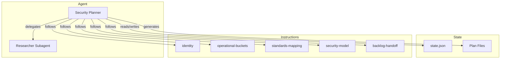

The Security Planner is a phase-based conversational agent that produces security models, standards mappings, and backlog handoff artifacts. It detects AI/ML components during scoping and coordinates with the RAI Planner for responsible AI assessments.

## Architecture

The agent follows five instruction files, each scoped to a specific concern. The identity instructions govern overall behavior and state management. The remaining four files provide phase-specific guidance for bucket classification, standards mapping, security model analysis, and backlog generation.

## State Management

All state lives in `.copilot-tracking/security-plans/{project-slug}/state.json`. The agent follows a six-step protocol on every turn:

| Step      | Action                                                                 |
|-----------|------------------------------------------------------------------------|
| READ      | Load the current state file                                            |
| VALIDATE  | Confirm the state schema is intact and the current phase is consistent |
| DETERMINE | Decide which phase and step to execute based on state and user input   |
| EXECUTE   | Perform the phase work (questions, analysis, artifact generation)      |
| UPDATE    | Modify the in-memory state to reflect completed work                   |
| WRITE     | Persist the updated state back to the file                             |

### State Fields

The state file tracks over 16 fields across scoping, analysis, and handoff concerns.

| Field                  | Type     | Description                                         |
|------------------------|----------|-----------------------------------------------------|
| `projectSlug`          | string   | Kebab-case project identifier                       |
| `securityPlanFile`     | string   | Path to the main plan markdown file                 |
| `currentPhase`         | number   | Current phase (1-6)                                 |
| `entryMode`            | string   | `from-prd` or `capture`                             |
| `bucketsCompleted`     | string[] | Operational buckets that have been classified       |
| `standardsMapped`      | string[] | Buckets with completed standards mapping            |
| `riskSurfaceStarted`   | boolean  | Whether Phase 4 threat modeling has begun           |
| `handoffGenerated`     | object   | `{ado: boolean, github: boolean}`                   |
| `referencesProcessed`  | string[] | Paths to PRD/BRD artifacts that were consumed       |
| `nextActions`          | string[] | Pending actions for the current or next phase       |
| `userPreferences`      | object   | Autonomy preference: `full`, `partial`, or `manual` |
| `raiEnabled`           | boolean  | Whether AI/ML components were detected              |
| `raiScope`             | string   | `none`, `lightweight`, or `full`                    |
| `raiTier`              | string   | `none`, `basic`, `standard`, or `comprehensive`     |
| `raiPlannerDispatched` | boolean  | Whether the RAI Planner handoff has been triggered  |
| `aiComponents`         | string[] | List of detected AI/ML components                   |

## Interaction Model

The agent follows strict question rules during each phase:

| Guardrail                             | Description                                                                                        |
|---------------------------------------|----------------------------------------------------------------------------------------------------|
| 3-5 questions per turn                | Enough to make progress without overwhelming the user                                              |
| Emoji checklists                      | Questions use ❓ for pending, ✅ for answered, and ❌ for blocked items                               |
| No phase advance without confirmation | The agent summarizes phase findings and asks for explicit approval before moving to the next phase |

## Session Resume

When a conversation resumes from a prior session, the agent follows a four-step recovery protocol:

1. Read the state file from `.copilot-tracking/security-plans/{project-slug}/`.
2. Validate that the state schema matches the expected version.
3. Present a summary of completed phases and pending work.
4. Continue from the current phase without re-asking answered questions.

A five-step post-summarization recovery handles cases where conversation context was compacted by the chat system.

## Operational Constraints

* All generated files are placed under `.copilot-tracking/security-plans/{project-slug}/`.
* The agent never modifies source code or files outside its tracking directory.
* The Researcher Subagent is dispatched only for WAF/CAF runtime lookups during Phase 3.
* RAI Planner handoff in Phase 6 provides the agent path and suggests the `from-security-plan` entry mode but does not force the user to continue.

## Related Files

| File type    | Location                                                     |
|--------------|--------------------------------------------------------------|
| Agent        | `.github/agents/security-planning/security-planner.agent.md` |
| Prompts      | `.github/prompts/security-planning/`                         |
| Instructions | `.github/instructions/security-planning/`                    |
| State        | `.copilot-tracking/security-plans/{project-slug}/state.json` |

<!-- markdownlint-disable MD036 -->
*🤖 Crafted with precision by ✨Copilot following brilliant human instruction,
then carefully refined by our team of discerning human reviewers.*
<!-- markdownlint-enable MD036 -->
