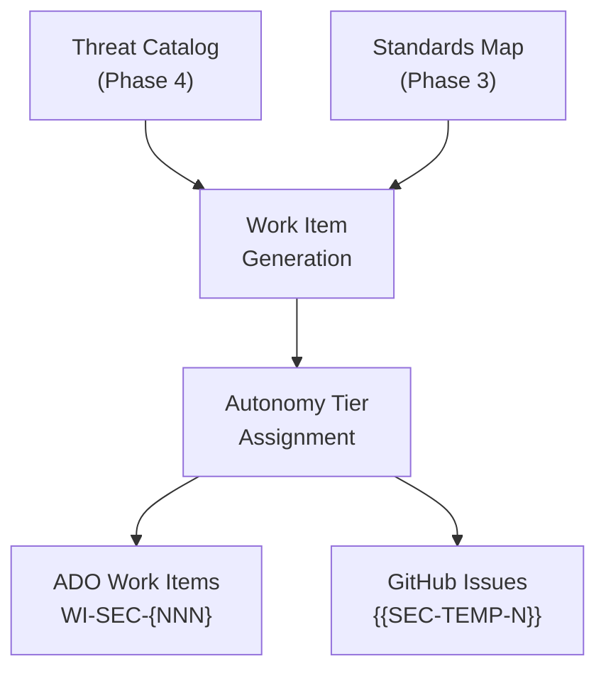
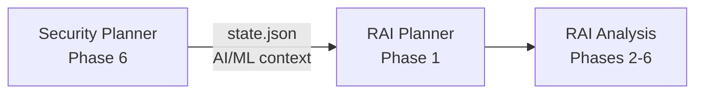

The Security Planner's final two phases convert analysis artifacts into actionable outputs. Phase 5 generates backlog items, and Phase 6 orchestrates the handoff, including dispatching the RAI Planner when AI/ML components are in scope.

## Backlog Generation Pipeline

### From Threats to Work Items

Each threat from Phase 4 maps to one or more backlog items. The mapping follows this structure:

* The threat ID (`T-{BUCKET}-{NNN}`) links the work item to its source.
* The severity rating influences the autonomy tier assignment.
* The standards mapping from Phase 3 provides compliance context for acceptance criteria.

### Dual-Platform Support

The agent generates work items for the platform the user selects (or both when requested):

| Platform | Format           | Structure                                                        |
|----------|------------------|------------------------------------------------------------------|
| ADO      | `WI-SEC-{NNN}`   | Title, description, acceptance criteria, severity, autonomy tier |
| GitHub   | `{{SEC-TEMP-N}}` | Issue title, body, labels, milestone suggestion                  |

Work items include enough context for an implementer to act without re-reading the full security plan: the threat description, affected components, relevant standards, and specific acceptance criteria.

### Autonomy Tier Assignment

The agent assigns each work item an autonomy tier based on implementation risk:

| Signal                         | Typical tier | Rationale                            |
|--------------------------------|--------------|--------------------------------------|
| Critical severity threat       | Manual       | Requires architectural decisions     |
| High severity, clear fix       | Partial      | Agent can draft, human reviews       |
| Medium severity, known pattern | Partial      | Standard remediation with oversight  |
| Low severity, configuration    | Full         | Low risk, agent can execute directly |

Users can override the suggested tier for any work item during the Phase 5 review.

## RAI Planner Dispatch

When Phase 1 detects AI/ML components, the Security Planner tracks four RAI-related fields throughout the analysis:

| Field          | Set during | Values                                       |
|----------------|------------|----------------------------------------------|
| `raiEnabled`   | Phase 1    | `true` / `false`                             |
| `raiScope`     | Phase 1    | `none`, `lightweight`, `full`                |
| `raiTier`      | Phase 1    | `none`, `basic`, `standard`, `comprehensive` |
| `aiComponents` | Phase 1    | List of detected components                  |

### The Handoff

In Phase 6, when `raiEnabled` is `true`, the agent:

1. **Summarizes AI/ML findings** from the security analysis, including which buckets contain AI/ML components and what threats were identified against them.
2. Presents the RAI Planner path: `.github/agents/rai-planning/rai-planner.agent.md`.
3. **Recommends the `from-security-plan` entry mode**, which allows the RAI Planner to read the completed security plan state as a starting point.
4. **Provides the state file location** so the RAI Planner can locate the project slug and existing analysis.

### What the RAI Planner Receives

The RAI Planner's `from-security-plan` entry mode consumes:

* The security plan's `state.json` (read-only).
* The detected AI/ML components list.
* The RAI scope and tier classification.
* Threat IDs that involve AI/ML components, allowing the RAI Planner to continue threat ID sequences rather than starting fresh.

> [!NOTE]
> The handoff is a recommendation, not an automatic dispatch. The user decides whether to continue with the RAI Planner in a new chat session.

## Pipeline Artifacts

All artifacts generated by the handoff pipeline are stored under the project's tracking directory.

| Artifact               | Path                                                        | Phase |
|------------------------|-------------------------------------------------------------|-------|
| Backlog items (ADO)    | `.copilot-tracking/security-plans/{slug}/backlog-ado.md`    | 5     |
| Backlog items (GitHub) | `.copilot-tracking/security-plans/{slug}/backlog-github.md` | 5     |
| Review summary         | `.copilot-tracking/security-plans/{slug}/review-summary.md` | 6     |
| RAI dispatch record    | Updated in `state.json` (`raiPlannerDispatched: true`)      | 6     |

## End-to-End Flow

Complete pipeline from threat to handoff

1. Phase 4 produces threats with IDs, severity, and bucket assignments.
2. Phase 5 converts each threat into one or more work items with acceptance criteria.
3. Each work item receives an autonomy tier based on severity and implementation complexity.
4. Work items are formatted for the selected platform (ADO, GitHub, or both).
5. Phase 6 validates completeness across all buckets and threats.
6. If `raiEnabled`, the agent presents the RAI Planner handoff with entry mode guidance.
7. The user starts a new session with the RAI Planner to continue the assessment.

<!-- markdownlint-disable MD036 -->
*🤖 Crafted with precision by ✨Copilot following brilliant human instruction,
then carefully refined by our team of discerning human reviewers.*
<!-- markdownlint-enable MD036 -->
