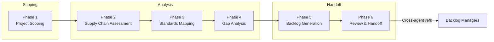

The SSSC Planner agent walks your team through a structured six-phase supply chain security assessment. It starts with project scoping, inventories existing security capabilities across hve-core and physical-ai-toolchain, maps findings to OpenSSF Scorecard checks, performs gap analysis with adoption categorization, generates prioritized backlog items, and produces improvement projections for Scorecard scores, SLSA levels, and Best Practices Badge readiness.

> The goal is not to replace supply chain security expertise. It is to make sure every repository gets a consistent capability inventory, every gap gets mapped to an adoption path, and the resulting work items land in your backlog with enough context to act on.

## Why Use SSSC Planning?

| Benefit                      | Description                                                                                                                         |
|------------------------------|-------------------------------------------------------------------------------------------------------------------------------------|
| 🔗 Consistent coverage       | Every repository gets the same 27-capability inventory and 20-check Scorecard mapping, so nothing falls through the cracks          |
| 🔍 Standards-backed analysis | Gaps are mapped to OpenSSF Scorecard, SLSA Build levels, and Best Practices Badge criteria rather than ad-hoc checklists            |
| ⚡ Actionable output          | The final phase produces backlog items with adoption steps, priority derived from risk level, and improvement projections per check |

> [!TIP]
> New to the agent? Read [Why SSSC Planning?](why-sssc-planning) for the reasoning behind each phase.

## The SSSC Planning Flow

## The Six Phases

### Phase 1: Project Scoping

Captures the target repository's technology stack, package managers, CI platform, release strategy, and compliance targets. Entry mode determines whether scope is gathered interactively, seeded from a PRD, BRD, or an existing Security Planner state file.

### Phase 2: Supply Chain Assessment

Inventories 27 supply chain security capabilities across hve-core and physical-ai-toolchain. Each capability is classified as hve-core unique, PAT unique, or shared, and assigned a coverage status (✅ present, ⚠️ partial, ❌ missing, ➖ not applicable).

### Phase 3: Standards Mapping

Maps the capability inventory to five standard areas: OpenSSF Scorecard (20 checks), SLSA Build Track (L0-L3), Best Practices Badge (Passing/Silver/Gold), Sigstore signing maturity, and SBOM generation standards. Each check receives a current score estimate.

### Phase 4: Gap Analysis

Compares current posture against desired state, classifies each gap into one of six adoption categories (reusable workflow, workflow copy/modify, workflow + script, platform configuration, new capability, N/A), and assigns T-shirt effort sizing.

### Phase 5: Backlog Generation

Produces work items for Azure DevOps (`WI-SSSC-{NNN}`) or GitHub Issues (`{{SSSC-TEMP-N}}`), each linked to the gaps and standards that motivated it. Priority is derived from Scorecard risk level (Critical → P1, High → P2, Medium → P3, Low → P4).

### Phase 6: Review and Handoff

Validates completeness, generates Scorecard improvement projections (current vs. projected score per check), SLSA level assessment, Badge readiness evaluation, and produces platform-specific handoff files for backlog managers.

## Autonomy Levels

Work items generated in Phase 5 are assigned an autonomy tier that controls how much human oversight each item receives.

| Tier    | Description                     | When used                                     |
|---------|---------------------------------|-----------------------------------------------|
| Full    | Agent executes without approval | Low-risk configuration changes                |
| Partial | Agent drafts, human approves    | Default tier for most supply chain work items |
| Manual  | Human plans and executes        | High-risk items requiring new capabilities    |

## Entry Modes

The SSSC Planner supports four entry modes, each matched to a prompt file.

| Mode               | Prompt                    | Starting point                                             |
|--------------------|---------------------------|------------------------------------------------------------|
| Capture            | `sssc-capture`            | Starts a blank Phase 1 interview to gather scope directly  |
| From-PRD           | `sssc-from-prd`           | Seeds Phase 1 from PRD artifacts found in the workspace    |
| From-BRD           | `sssc-from-brd`           | Seeds Phase 1 from BRD artifacts found in the workspace    |
| From-Security-Plan | `sssc-from-security-plan` | Seeds Phase 1 from an existing Security Planner state file |

## When to Use

| Scenario                                        | Recommended approach    |
|-------------------------------------------------|-------------------------|
| New repository with existing PRD                | From-PRD mode           |
| New repository with existing BRD                | From-BRD mode           |
| Repository with completed security plan         | From-Security-Plan mode |
| Existing repository without formal requirements | Capture mode            |

## Quick Start

1. Open the prompt picker and select one of the four SSSC prompt files (Capture, From-PRD, From-BRD, or From-Security-Plan).
2. Provide a project slug when prompted (or let the agent generate one).
3. Answer the scoping questions. The agent asks 3-5 questions per turn until each phase is complete.
4. Review the generated backlog items and adjust autonomy tiers as needed.
5. Follow the backlog manager handoff in Phase 6 to create work items in ADO or GitHub.

> [!IMPORTANT]
> Start each new SSSC plan in a fresh chat session. Use `/clear` to reset context if you need to restart.

## Prerequisites

* The SSSC Planner agent installed and enabled in your VS Code workspace.
* The `Researcher Subagent` available for WAF and CAF runtime lookups.
* For From-PRD/From-BRD mode: PRD or BRD artifacts present under `.copilot-tracking/`.
* For From-Security-Plan mode: A completed Security Planner state file.

## Next Steps

* [Why SSSC Planning?](why-sssc-planning) for the reasoning behind each phase.
* [Agent Overview](agent-overview) for the architecture and state management details.
* [Entry Modes](entry-modes) for a deep dive into all four entry mode workflows.
* [Phase Reference](phase-reference) for phase-by-phase field and artifact details.
* [Handoff Pipeline](handoff-pipeline) for backlog generation and improvement projections.

<!-- markdownlint-disable MD036 -->
*🤖 Crafted with precision by ✨Copilot following brilliant human instruction,
then carefully refined by our team of discerning human reviewers.*
<!-- markdownlint-enable MD036 -->
