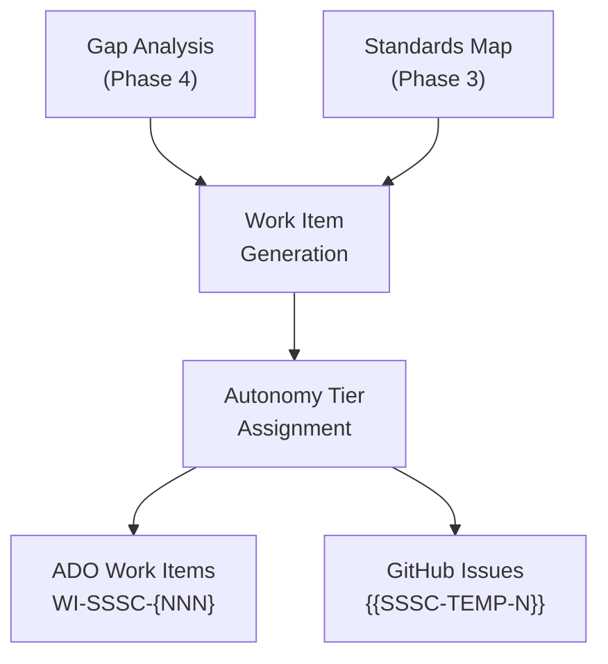
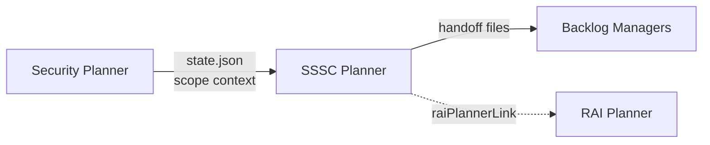

The SSSC Planner's final two phases convert analysis artifacts into actionable outputs. Phase 5 generates backlog items from gap analysis results, and Phase 6 orchestrates the handoff with improvement projections for Scorecard scores, SLSA levels, and Badge readiness.

## Backlog Generation Pipeline

### From Gaps to Work Items

Each gap from Phase 4 maps to one or more backlog items. The mapping follows this structure:

* The gap description and Scorecard check link the work item to its source.
* The risk level determines the priority assignment (Critical → P1, High → P2, Medium → P3, Low → P4).
* The adoption category from Phase 4 provides the implementation approach.
* The standards mapping from Phase 3 provides compliance context for acceptance criteria.

### Dual-Platform Support

The agent generates work items for the platform the user selects (or both when requested):

| Platform | Format            | Structure                                                              |
|----------|-------------------|------------------------------------------------------------------------|
| ADO      | `WI-SSSC-{NNN}`   | Title, HTML description, acceptance criteria, severity, type hierarchy |
| GitHub   | `{{SSSC-TEMP-N}}` | Issue title, YAML metadata, markdown body, labels, milestone           |

Work items include enough context for an implementer to act without re-reading the full SSSC plan: the gap description, affected Scorecard check, adoption steps with file paths or workflow references, and specific acceptance criteria.

### Autonomy Tier Assignment

The agent assigns each work item an autonomy tier based on implementation risk:

| Signal                         | Typical tier | Rationale                            |
|--------------------------------|--------------|--------------------------------------|
| New capability (Fuzzing, etc.) | Manual       | Requires architectural decisions     |
| Cross-cutting pipeline changes | Partial      | Agent can draft, human reviews       |
| Workflow or script adoption    | Partial      | Standard adoption with oversight     |
| Platform configuration         | Full         | Low risk, agent can execute directly |

Users can override the suggested tier for any work item during the Phase 5 review.

## Improvement Projections

Phase 6 generates three improvement projections that show the expected return on investment if all backlog items are completed.

### Scorecard Projection

For each of the 20 checks, the agent projects the score improvement:

| #   | Check        | Risk   | Current Score | Projected Score | Related Work Items   |
|-----|--------------|--------|---------------|-----------------|----------------------|
| *n* | *check_name* | *risk* | *current*/10  | *projected*/10  | *WI-SSSC-{NNN}, ...* |

A summary row provides the estimated overall Scorecard score improvement.

### SLSA Level Assessment

The agent projects which SLSA Build level the repository would achieve:

| Field           | Value                                         |
|-----------------|-----------------------------------------------|
| Current level   | Build L{N}                                    |
| Projected level | Build L{N}                                    |
| Remaining steps | What would still be needed beyond the backlog |

### Badge Readiness

The agent assesses which Best Practices Badge tier the repository would qualify for:

| Field               | Value                                     |
|---------------------|-------------------------------------------|
| Current readiness   | Passing, Silver, Gold, or Not enrolled    |
| Projected readiness | Passing, Silver, or Gold                  |
| Missing criteria    | Items not covered by the backlog (if any) |

## Cross-Agent Handoff

The SSSC Planner coordinates with other agents through state file references rather than direct dispatch.

| Direction                | Description                                                                                                                                               |
|--------------------------|-----------------------------------------------------------------------------------------------------------------------------------------------------------|
| Security Planner to SSSC | The `from-security-plan` entry mode reads the Security Planner's completed state file to inherit scope context. `securityPlannerLink` records the source. |
| SSSC to Backlog Managers | Handoff files are written to platform-specific paths for the ADO Backlog Manager or GitHub Backlog Manager to consume.                                    |
| SSSC to RAI Planner      | If `raiPlannerLink` is populated, the handoff summary includes a cross-reference for continuity across security domains.                                  |

> [!NOTE]
> Cross-agent handoffs are references, not automatic dispatches. The user decides whether to invoke the next agent.

## Pipeline Artifacts

All artifacts generated by the handoff pipeline are stored under the project's tracking directory.

| Artifact             | Path                                                                   | Phase |
|----------------------|------------------------------------------------------------------------|-------|
| Work items (ADO)     | `.copilot-tracking/workitems/backlog/{slug}-sssc/work-items.md`        | 5     |
| Work items (GitHub)  | `.copilot-tracking/github-issues/discovery/{slug}-sssc/issues-plan.md` | 5     |
| Scorecard projection | Included in the SSSC plan file                                         | 6     |
| Handoff summary      | `.copilot-tracking/sssc-plans/{slug}/handoff-summary.md`               | 6     |

## End-to-End Flow

Complete pipeline from gap analysis to handoff

1. Phase 4 produces gaps with Scorecard check mappings, adoption categories, and effort sizing.
2. Phase 5 converts each gap into one or more work items with adoption steps and acceptance criteria.
3. Each work item receives a priority (P1-P4) from risk level and an autonomy tier from implementation risk.
4. Work items are formatted for the selected platform (ADO, GitHub, or both).
5. Phase 6 validates completeness across all Scorecard checks and gaps.
6. Improvement projections are generated for Scorecard scores, SLSA levels, and Badge readiness.
7. Platform-specific handoff files are written for backlog managers to consume.

<!-- markdownlint-disable MD036 -->
*🤖 Crafted with precision by ✨Copilot following brilliant human instruction,
then carefully refined by our team of discerning human reviewers.*
<!-- markdownlint-enable MD036 -->
